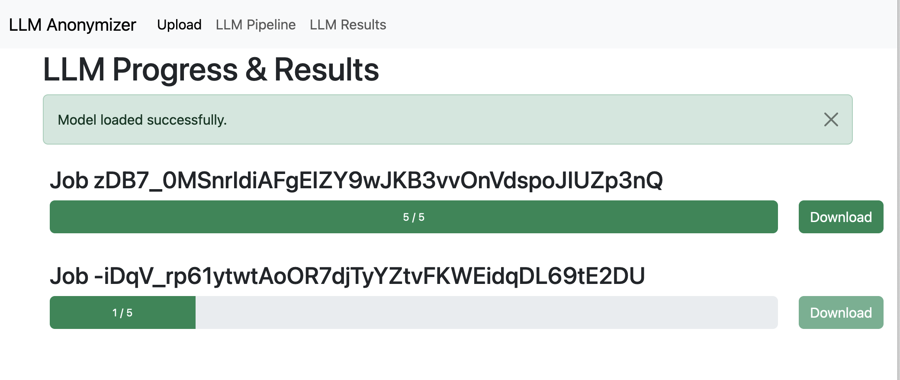
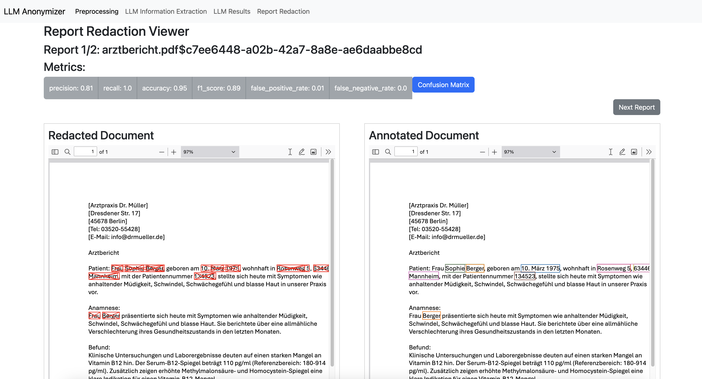

# LLM Anonymizer 



Tool to anonymize medical reports removing person-related information.

Features:

- Supports various input formats like pdf, images and text documents
- Performs OCR if necessary
- Extracts person-related information from the reports using a llama model
- Matches the extracted personal information in the reports using a fuzzy matching algorithm based on the Levenshtein distance
- Compare documents and calculate metrics using annotated pdf files ([Inception](https://inception-project.github.io/))

New:

Information Extraction using LLMs and Calculate Metrics on Label-basis



## Examples

An example of a doctoral report in various formats can be found in the examples directory.


## Launch LLM Anonymizer

TODO: Create environment with all necessary requirements.

Run:
`python app.py`

|Parameter|Description|Example|
|---|---|---|
|--model_path|Directory with downloaded model files which can be processed by llama.cpp|/path/to/models|
|--n_predict|How many tokens to predict. Will crash if too little. Default: 2048|200|
|--server_path|Path of llama cpp executable (on Windows: server.exe).|/path/to/llamacpp/executable/server|
|--port|Port on which this web app should be started on. Default: 5001|5001|
|--config_file|Custom path to the configuration file.|config.yml|
|--n_gpu_layers|How many model layers to offload to the GPU. Default: 100 (whole model on GPU)|100|

## Usage

### Preprocessing

First, all input files are preprocessed to a csv file which contains all text from all reports. Currently pdf, docx, odf, txt, png and jpg files can be used as input. If necessary, text recognition (OCR) is applied. 

After the preprocessing is complete, you can download the csv file. 

### LLM Information Extraction and Anonymization

> Extract personal information from the medical reports.

Use the csv file from the preprocessing step as an input, choose a model and adjust the prompt, grammar and temperature accordingly. When you click `Run Pipeline` you will be redirected to the LLM results tab. Wait for the results to be available for download. You don't have to reload the page! In the meantime you can also start more information extraction jobs.

The output consists of a csv file with columns `report` with the original report, `report_masked` which contains the anonymized report and more columns with the personal information extracted according to the grammar.


## Example Grammar

```

root   ::= allrecords
value  ::= object | array | string | number | ("true" | "false" | "null") ws

allrecords ::= (
  "{"
  ws "\"patientennachname\":" ws string ","
  ws "\"patientenvorname\":" ws string ","
  ws "\"patientengeburtsdatum\":" ws string ","
  ws "\"patientenid\":" ws string ","
  ws "\"patientenstrasse\":" ws string ","
  ws "\"patientenhausnummer\":" ws string ","
  ws "\"patientenpostleitzahl\":" ws string ","
  ws "\"patientenstadt\":" ws string ","
  ws "}"
  ws
)

record ::= (
    "{"
    ws "\"excerpt\":" ws ( string | "null" ) ","
    ws "\"present\":" ws ("true" | "false") ws 
    ws "}"
    ws
)

object ::=
  "{" ws (
            string ":" ws value
    ("," ws string ":" ws value)*
  )? "}" ws

array  ::=
  "[" ws (
            value
    ("," ws value)*
  )? "]" ws

string ::=
  "\"" (
    [^"\\] |
    "\\" (["\\/bfnrt] | "u" [0-9a-fA-F] [0-9a-fA-F] [0-9a-fA-F] [0-9a-fA-F]) # escapes
  )* "\"" ws

number ::= ("-"? ([0-9] | [1-9] [0-9]*)) ("." [0-9]+)? ([eE] [-+]? [0-9]+)? ws

# Optional space: by convention, applied in this grammar after literal chars when allowed
ws ::= ([ \t\n])?
```
## MODEL Links
- Phi-3-mini-4k-instruct-fp16.gguf microsoft/Phi-3-mini-4k-instruct-gguf

## TODO

- IDs in csv
- Schätzung / automatisches Split bei zu vielen Token
- PDF schwärzen (side-by-side display)
- replace_personal_info anpassen (linked #TODO)
- raw LLM output download
- settings for postprocessing
- add metadata file to zip
- fix error when old csv are used for llm
- report error in viewer warning
- support UIMA CAS JSON 0.4.0
- dockerize
- put original filename in csv

- variable ctx size (automatically adjust if not set manually)
- make excluded LLM output variable (what does the LLM answer if the information is unknown / not present in the text)
- When reports are split, put the already extracted information in the input for the next part.

- page for general metrics
- classwise metrics
- Download all metrics

- Executor Fehler durchreichen
- skip annotation json entry if no label is set

- Select box in the viewer to select a specific case

- Information Extraction: CSV with text label as input, viewer for metrics and pdfs.