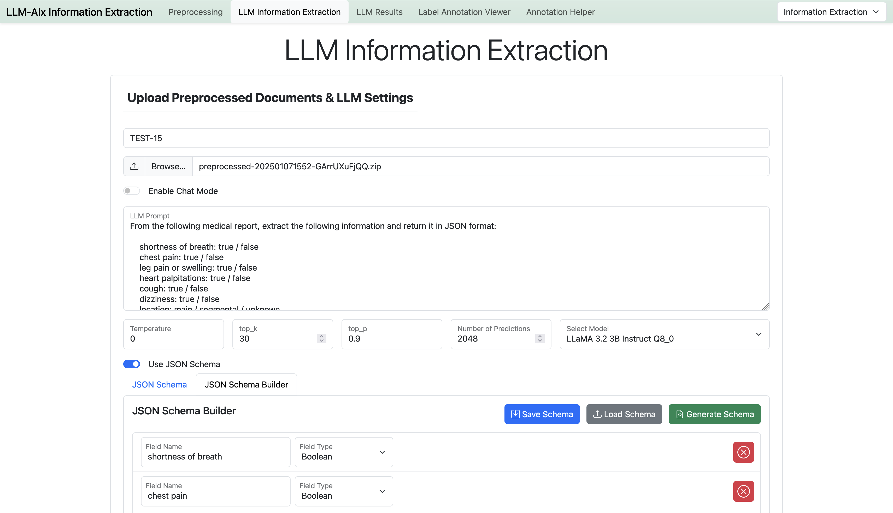
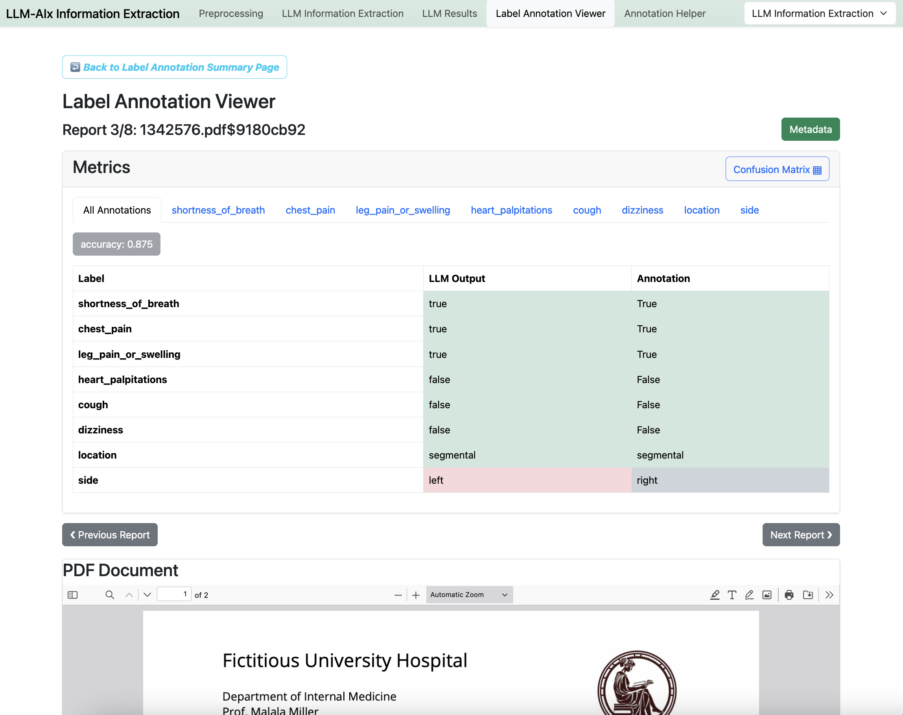
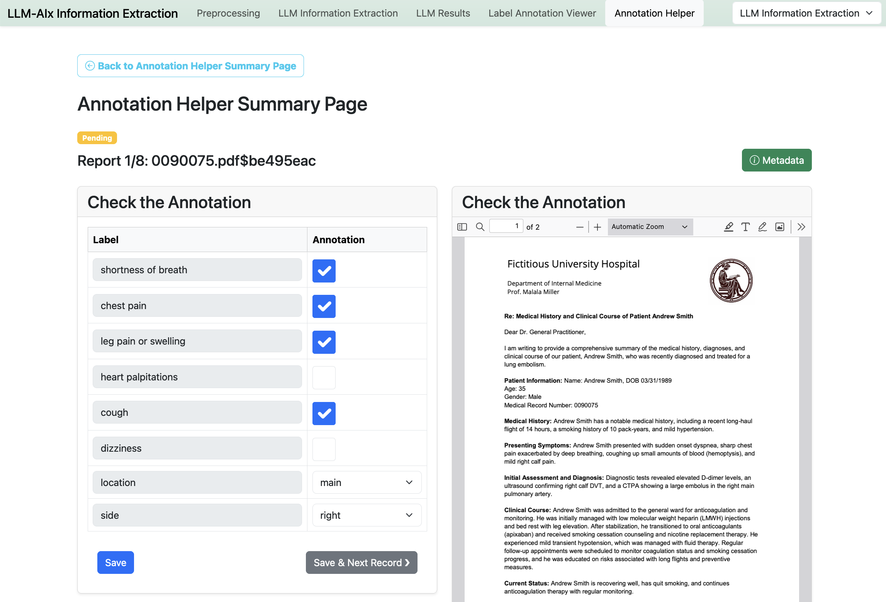
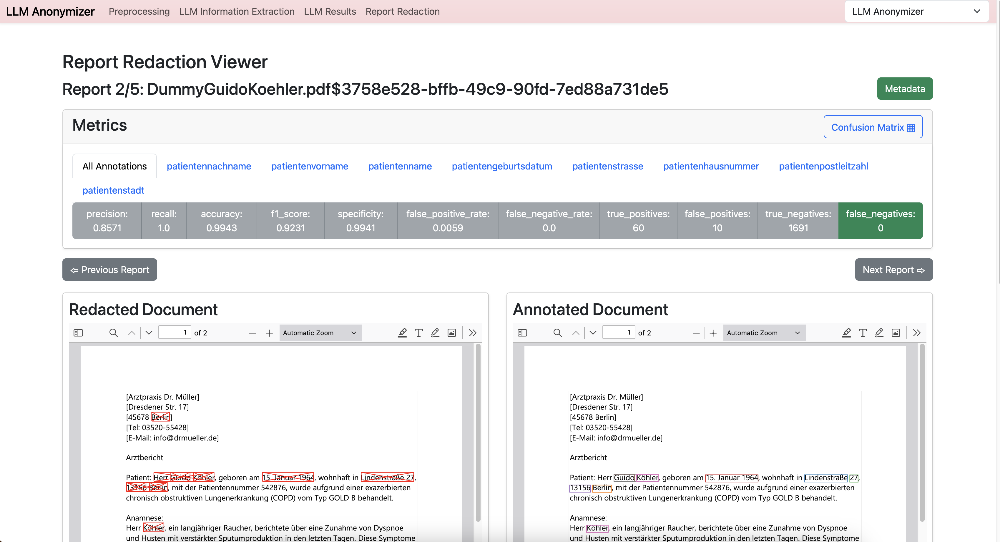

[](https://github.com/KatherLab/LLMAnonymizer/actions/workflows/docker-image.yml)

# LLM-AIx - Information Extraction & Anonymization

> [!IMPORTANT]
> Release of **llmaixlib** - a Python library which wraps the Preprocessing (including OCR) and Information Extraction.
>
> [Check it out!](https://github.com/KatherLab/llmaixlib)

> [!CAUTION]
> This tool is a prototype which is in active development and is still undergoing major changes. Please always check the results!
> 
> **Use for research purposes only!**



Web-based tool to extract structured information from medical reports, anonymize documents.

**Features**:

- Supports various input formats: pdf, png, jpg, jpeg, txt, csv, xlsx and docx (only if Word is installed on your system)
- Performs OCR if necessary (_tesseract_ and _surya-ocr_)
- Extracts (personal) information from medical reports in JSON format (enforced by a JSON schema or [llama.cpp GBNF grammar](https://github.com/ggerganov/llama.cpp/blob/master/grammars/README.md))

**Information Extraction**:

- Structured information extraction and comparison against a ground truth. 
- Support for **JSON Schemas** as an alternative to llama.cpp grammars.
- **NEW**: Support for OpenAI-compatible APIs (e.g. ChatGPT) instead of local models.
- Detailed metrics on label- and document-level.



**Annotation Helper**:

- Speed up your annotation process by using the LLM output as a starting point and only curate the LLM output.



**Anonymizer**:

- Matches the extracted personal information in the reports using a fuzzy matching algorithm based on the Levenshtein distance (configurable)
- Compare documents and calculate metrics using annotated pdf files as a ground truth ([Inception](https://inception-project.github.io/))



## Usage

View one of the tutorials:

[Information Extraction Tutorial](static/information_extraction.md)

[Anonymizer Tutorial](static/anonymization.md)

## Hardware Requirements

[Hardware Requirements](static/hardware.md)


## Examples

Examples of doctoral reports in various formats as well as grammar examples and annotations can be found in the `examples` directory.


## LLM Models and Model Config

LLM-AIx supports all models which are supported by llama-cpp at the time. Please download models in the **gguf** format. 

In addition, create a config.yml file inside of the model directoy and configure your downloaded models according to the following example.


Example config.yml file:
```yaml
models:
  - name: "llama3.1_8b_instruct_q5km"
    display_name: "LLaMA 3.1 8B Instruct Q5_K_M"
    file_name: "Meta-Llama-3.1-8B-Instruct-Q5_K_M.gguf"
    model_context_size: 128000 # Right now only informative.
    kv_cache_size: 16000 # Which size should the llama.cpp KV Cache have?
    kv_cache_quants: "q8_0" # e.g. "q_8" or "q_4" - requires flash attention
    flash_attention: true # does not work for some models
    mlock: true
    server_slots: 1 # How many requests should be processed in parallel. Please note: The size of each slot is kv_cache_size / server_slots!
    seed: 42 # Random initialization
    n_gpu_layers: 200 # How many layers to offload to the GPU. You should always try to offload all! e.g. 33 for Llama 3.1 8B or 82 for Llama 3.1 70B. Can be set to e.g. 200 to make sure all layers are offloaded for (almost) all models.
```

## Run with Docker (CUDA)

> [!IMPORTANT]
> The docker images currently only support NVIDIA GPUs with compute level 8.6 or higher (Ampere generation). You can manually build the docker image for other architectures or use the manual setup. Llama.cpp which is used as a backend for LLM-AIx supports a huge variety of hardware (including NVIDIA, AMD, Apple, Intel GPUs and also CPUs).

This Docker image ships [llama.cpp](https://github.com/ggerganov/llama.cpp), special thanks to all contributors!

1. Download the desired models (must be compatible with llama-cpp, in gguf format, e.g. from HuggingFace) into a new models directory!
2. Download/Clone this repository: `git clone https://github.com/KatherLab/LLMAIx.git`
3. Go to the repository directory: `cd LLMAIx`
4. Edit `docker-compose.yml` with the correct path to the models directory. Inside of this model path should be the _.gguf_ files as well as the adapted `config.yml` file.
5. Run the docker image: `docker compose up` (add `-d` to run in detached mode)

Now access in your browser via `http://localhost:19999`

Update the docker image: `docker compose pull`


## Run with Docker (API only)

> [!TIP]
> If you want to use LLMAIx only with an OpenAI-compatible API, then you don't need the large CUDA-enabled docker images including llama.cpp.

> [!IMPORTANT]
> This packages does only contain support for the tesseract OCR method!

1. Clone this repository: `git clone https://github.com/KatherLab/LLMAIx.git`
2. Go to the repository directory: `cd LLMAIx`
3. Edit `docker-compose-api.yml` with the `API_URL` and `API_KEY`. 
4. Run the docker image: `docker compose -f docker-compose-api.yml up` (add `-d` to run in detached mode)

Update the docker image: `docker compose -f docker-compose-api.yml pull`

## Build Docker Image

Run `docker compose build` inside of the repository.

> [!Tip]
> You can specify the compute level of your CUDA-capable GPU in the docker-compose file. 
>
> Use `86` for compute level 8.6 (Ampere generation, except the server GPUs like A100 which need 8.0).
>
> Look up here for your GPU: [GPU Compute Capabilites](https://developer.nvidia.com/cuda-gpus)


## Manual Setup

1. Download and extract or build [llama-cpp](https://github.com/ggerganov/llama.cpp) for your operating system.
2. Download desired models (must be compatible with llama-cpp, in gguf format)
3. Update the config.yml file with the downloaded models accordingly.
4. If you intend to use OCR: Install [OCRmyPDF](https://ocrmypdf.readthedocs.io/en/latest/installation.html#)
5. Create a python venv or a conda environment (tested with *Python 3.12.1*) with requirements.txt:
  - `python -m venv venv`
  - `source venv/bin/activate`
  - `pip install -r requirements.txt`

6. Run: `python app.py`


## LLMAIx Parameters

|Parameter|Description|Example|
|---|---|---|
|--model_path|Directory with downloaded model files which can be processed by llama.cpp|/path/to/models|
|--server_path|Path of llama cpp executable (on Windows: server.exe).|/path/to/llamacpp/executable/server|
|--host|Hostname of the server. Default: 0.0.0.0|0.0.0.0 or localhost|
|--port|Port on which this web app should be started on. Default: 5001|5001|
|--config_file|Custom path to the configuration file.|config.yml|
|--llamacpp_port|On which port to run the llama-cpp server. Default: 2929|2929|
|--debug|When set, the web app will be started in debug mode and with auto-reload, for debugging and development|
|--mode|Which mode to run (`choice` will interactively ask the user). Can be `anonymizer`, `informationextraction`, `choice`. Default: 'choice'|choice|
|--disable_parallel|Disable parallel llama.cpp processing. Default: False|False|
|--no_parallel_preprocessing|Disable parallel preprocessing. Default: False|False|
|--verbose_llama|Enable verbose logging of llama.cpp. Default: False|False|
|--password|If a password is added, it will be used for password protection. Default username: llmaix||
|--api_url|If an OpenAI-compatible API URL is added, it will be used for OpenAI-compatible API requests. Default: ''|''|
|--api_key|If an API key is added, it will be used for OpenAI-compatible API requests. Default: ''|''|
|--only_api|If specified, you have to set --api_url and --api_key. The model config / llama.cpp server path will not be checked. Default: False|


## Additional Notes

> [!NOTE] 
> An active internet connection is currently required. This is because some javascript and CSS libraries are loaded directly from CDNs. To change that please download them and replace the respective occurrences in the html files.

## JSON Schema Builder

To generate JSON Schemas for structured generation without having to install LLM-AIx, you can use the [JSON Schema Builder](https://katherlab.github.io/LLMAIx/).

## Contributions

Please open an issue or discussion if you have any question.Pull requests are welcome!

## Citation

This repository is part of this publication: [LLM-AIx: An open source pipeline for Information Extraction from unstructured medical text based on privacy pre-serving Large Language Models](https://doi.org/10.1101/2024.09.02.24312917)


## License

This project ships under the [AGPL-3.0](LICENSE) license.

## Docker images: Llama CPP License

The docker images include a pre-built version of [llama.cpp](https://github.com/ggerganov/llama.cpp), special thanks to all contributors!

Please note the [MIT licence](https://github.com/ggerganov/llama.cpp/blob/master/LICENSE) of llama.cpp!
