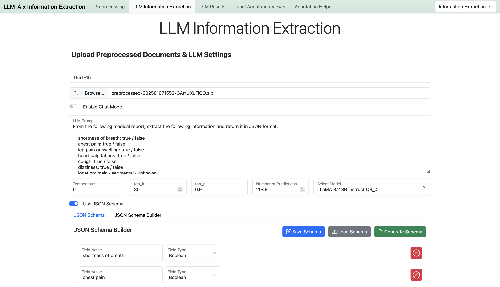
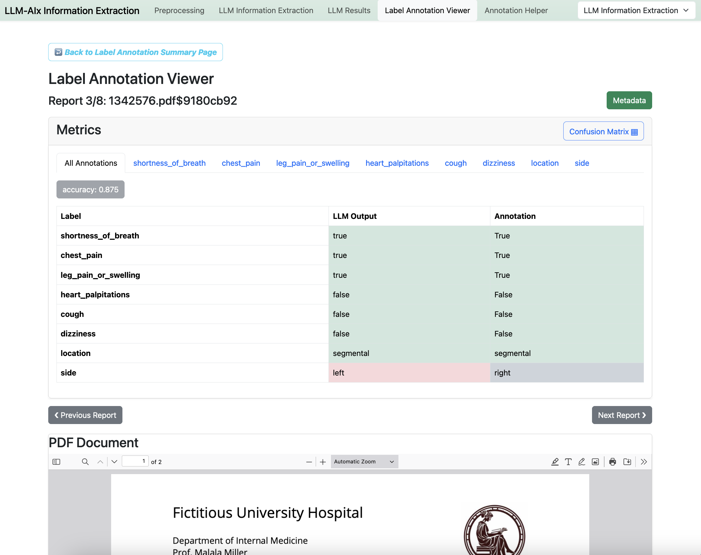
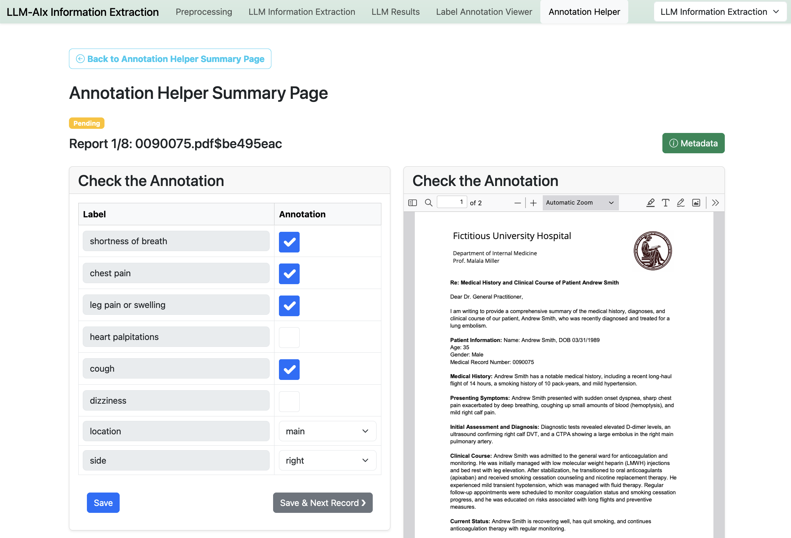
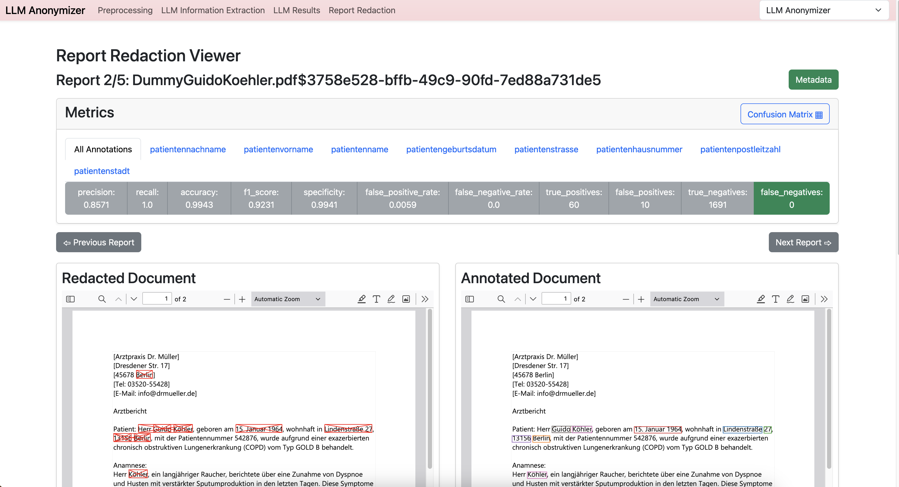

[](https://github.com/KatherLab/LLMAnonymizer/actions/workflows/docker-image.yml)

# LLM-AIx - Information Extraction & Anonymization

> [!IMPORTANT]
> Release of **LLMAIx-v2** - a new pipeline for managing your information extraction projects.
>
> [Check it out!](https://github.com/KatherLab/llmaixweb)

> [!CAUTION]
> This tool is a prototype which is in active development and is still undergoing major changes. Please always check the results!
>
> **Use for research purposes only!**



Web-based tool to extract structured information from medical reports, anonymize documents.

**Features**:

- Supports various input formats: pdf, png, jpg, jpeg, txt, csv, xlsx and docx (only if Word is installed on your system)
- Performs OCR if necessary (_tesseract_ and _surya-ocr_)
- Extracts (personal) information from medical reports in JSON format (enforced by a JSON schema or [llama.cpp GBNF grammar](https://github.com/ggerganov/llama.cpp/blob/master/grammars/README.md))

**Information Extraction**:

- Structured information extraction and comparison against a ground truth. 
- Support for **JSON Schemas** as an alternative to llama.cpp grammars.
- **NEW**: Support for OpenAI-compatible APIs (e.g. GPT-5) instead of local models.
- Detailed metrics on label- and document-level.



**Annotation Helper**:

- Speed up your annotation process by using the LLM output as a starting point and only curate the LLM output.



**Anonymizer**:

- Matches the extracted personal information in the reports using a fuzzy matching algorithm based on the Levenshtein distance (configurable)
- Compare documents and calculate metrics using annotated pdf files as a ground truth ([Inception](https://inception-project.github.io/))



## Usage

View one of the tutorials:

[Information Extraction Tutorial](static/information_extraction.md)

[Anonymizer Tutorial](static/anonymization.md)

## Hardware Requirements

[Hardware Requirements](static/hardware.md)


## Examples

Examples of doctoral reports in various formats as well as grammar examples and annotations can be found in the `examples` directory.


## LLM Models and Model Config

LLM-AIx supports all models which are supported by llama-cpp at the time (**gguf** format).

By default, models are loaded **directly from Hugging Face**: the repository ships a `config.yml` with [google/gemma-4-E4B-it-qat-q4_0-gguf](https://huggingface.co/google/gemma-4-E4B-it-qat-q4_0-gguf) preconfigured, which llama-server downloads automatically on first use (~5 GB) — no manual model download needed.

Default config.yml entry (Hugging Face model):
```yaml
models:
  - name: "gemma4_e4b_it_qat_q4_0"
    display_name: "Gemma 4 E4B IT QAT Q4_0"
    hf_repo: "google/gemma-4-E4B-it-qat-q4_0-gguf" # <user>/<model> on Hugging Face (must be a GGUF repo)
    # hf_quant: "Q4_K_M" # for repos with multiple quants: selects repo:Q4_K_M (case-insensitive)
    # hf_file: "..." # optional: exact GGUF filename, overrides hf_quant
    model_context_size: 131072 # Right now only informative.
    kv_cache_size: 16000 # Which size should the llama.cpp KV Cache have?
    kv_cache_quants: "q8_0" # e.g. "q8_0", "q4_0" or "f16" - requires flash attention
    flash_attention: true # does not work for some models
    mlock: true
    server_slots: 1 # How many requests should be processed in parallel. Please note: The size of each slot is kv_cache_size / server_slots!
    seed: 42 # Random initialization
    n_gpu_layers: 200 # How many layers to offload to the GPU. You should always try to offload all! e.g. 33 for Llama 3.1 8B or 82 for Llama 3.1 70B. Can be set to e.g. 200 to make sure all layers are offloaded for (almost) all models.
```

For gated or private Hugging Face repos, set the `HF_TOKEN` environment variable.

Alternatively, you can still use **manually downloaded model files**: download the gguf files into a models directory, create a `config.yml` there, and use `file_name` instead of `hf_repo`:
```yaml
models:
  - name: "llama3.1_8b_instruct_q5km"
    display_name: "LLaMA 3.1 8B Instruct Q5_K_M"
    file_name: "Meta-Llama-3.1-8B-Instruct-Q5_K_M.gguf"
    # ... same remaining options as above
```

## Docker images / supported hardware

LLMAIx no longer compiles llama.cpp itself. The Docker images are built on top
of the official prebuilt [llama.cpp](https://github.com/ggml-org/llama.cpp)
server images (pinned to a tested build), special thanks to all contributors!

| Image | Hardware | Platforms |
|---|---|---|
| `ghcr.io/katherlab/llmaix-cpu` | CPU only | `linux/amd64`, `linux/arm64` (incl. Docker Desktop on Apple Silicon) |
| `ghcr.io/katherlab/llmaix-cuda` | NVIDIA GPU (NVIDIA Container Toolkit required) | `linux/amd64` |
| `ghcr.io/katherlab/llmaix-api` | none (external OpenAI-compatible API only) | `linux/amd64`, `linux/arm64` |

> [!NOTE]
> On macOS, Docker Desktop runs a Linux VM, so it uses the **Linux ARM64 CPU
> image** — there is **no Metal/GPU acceleration inside Docker**. To use Apple
> Metal acceleration, run LLMAIx natively instead (see [Manual Setup](#manual-setup)).

The `llama-server` binary lives at `/app/llama-server` inside the CPU and CUDA
images and is started automatically by LLMAIx; llama.cpp stays internal to the
container.

## Run with Docker (CPU)

1. Download/Clone this repository: `git clone https://github.com/KatherLab/LLMAIx.git`
2. Go to the repository directory: `cd LLMAIx`
3. Run the docker image: `docker compose up` (add `-d` to run in detached mode)

That's it — the default model (Gemma 4 E4B) is downloaded automatically from Hugging Face on first use (~5 GB) and cached in a Docker volume for subsequent runs.

Now access in your browser via `http://localhost:19999`

Update the docker image: `docker compose pull`

> [!TIP]
> To use your own (manually downloaded) models instead: put the _.gguf_ files and an adapted `config.yml` into a local models directory, then edit `docker-compose.yml` to bind-mount that directory to `/models` and set `CONFIG_FILE=/models/config.yml` (see the comments in the compose file).

## Run with Docker (CUDA / NVIDIA GPU)

Requires the [NVIDIA Container Toolkit](https://docs.nvidia.com/datacenter/cloud-native/container-toolkit/latest/install-guide.html) on the host.

1. Follow steps 1-2 above (for custom models, edit `docker-compose-cuda.yml` instead).
2. Run: `docker compose -f docker-compose-cuda.yml up` (add `-d` to run in detached mode)

Now access in your browser via `http://localhost:19999`


## Run with Docker (API only)

> [!TIP]
> If you want to use LLMAIx only with an OpenAI-compatible API, then you don't need the large CUDA-enabled docker images including llama.cpp.

> [!IMPORTANT]
> This packages does only contain support for the tesseract OCR method!

1. Clone this repository: `git clone https://github.com/KatherLab/LLMAIx.git`
2. Go to the repository directory: `cd LLMAIx`
3. Copy the example environment file: `cp .env.example .env`
4. Edit `.env` and configure your `API_URL` and `API_KEY` for the OpenAI-compatible API.
5. Run the docker image: `docker compose -f docker-compose-api.yml up` (add `-d` to run in detached mode)

Update the docker image: `docker compose -f docker-compose-api.yml pull`

## Build Docker Image

Build the CPU image: `docker compose build`

Build the CUDA image: `docker compose -f docker-compose-cuda.yml build`

The images are based on official prebuilt llama.cpp server images pinned via the
`LLAMACPP_IMAGE` build arg in `Dockerfile_cpu` / `Dockerfile_cuda`. To test a
newer llama.cpp build, bump that tag (find available `server-b*` / `server-cuda-b*`
tags on the [llama.cpp package page](https://github.com/orgs/ggml-org/packages/container/package/llama.cpp)).


## Manual Setup

Run LLMAIx directly on your host (no Docker). This is also the way to use **Apple
Metal acceleration on macOS**, which is not available inside Docker.

1. Download, extract, or build [llama.cpp](https://github.com/ggml-org/llama.cpp) for your operating system. On macOS, use a native Metal-enabled `llama-server` build (the official macOS builds are Metal-enabled).
2. The bundled `config.yml` already points at a Hugging Face model (Gemma 4 E4B) which llama-server downloads automatically on first use — nothing else to do. To use manually downloaded gguf files instead, put them into a models directory (passed via `--model_path`) and adapt `config.yml` accordingly (see [LLM Models and Model Config](#llm-models-and-model-config)).
3. If you intend to use OCR: Install [OCRmyPDF](https://ocrmypdf.readthedocs.io/en/latest/installation.html#)
4. Install uv and set up the environment:
  - `curl -LsSf https://astral.sh/uv/install.sh | sh`
  - `uv venv && source .venv/bin/activate`
  - `uv sync`

5. Point LLMAIx at your `llama-server` binary and run it, e.g.:
  - `python app.py --server_path /path/to/llama-server`
  - or set the `LLAMA_SERVER_PATH` (or `SERVER_PATH`) environment variable.


## LLMAIx Parameters

|Parameter|Description|Example|
|---|---|---|
|--model_path|Directory with downloaded model files which can be processed by llama.cpp|/path/to/models|
|--server_path|Path of the llama-server executable. In the official Docker images this is `/app/llama-server`. Can also be set via the `LLAMA_SERVER_PATH` / `SERVER_PATH` environment variable.|/app/llama-server|
|--host|Hostname of the server. Default: 0.0.0.0|0.0.0.0 or localhost|
|--port|Port on which this web app should be started on. Default: 5001|5001|
|--config_file|Custom path to the configuration file.|config.yml|
|--llamacpp_port|On which port to run the llama-cpp server. Default: 2929|2929|
|--debug|When set, the web app will be started in debug mode and with auto-reload, for debugging and development|
|--mode|Which mode to run (`choice` will interactively ask the user). Can be `anonymizer`, `informationextraction`, `choice`. Default: 'choice'|choice|
|--disable_parallel|Disable parallel llama.cpp processing. Default: False|False|
|--no_parallel_preprocessing|Disable parallel preprocessing. Default: False|False|
|--verbose_llama|Enable verbose logging of llama.cpp. Default: False|False|
|--password|If a password is added, it will be used for password protection. Default username: llmaix||
|--api_url|If an OpenAI-compatible API URL is added, it will be used for OpenAI-compatible API requests. Default: ''|''|
|--api_key|If an API key is added, it will be used for OpenAI-compatible API requests. Default: ''|''|
|--only_api|If specified, you have to set --api_url and --api_key. The model config / llama.cpp server path will not be checked. Default: False|


## Additional Notes

> [!NOTE] 
> An active internet connection is currently required. This is because some javascript and CSS libraries are loaded directly from CDNs. To change that please download them and replace the respective occurrences in the html files.

## JSON Schema Builder

To generate JSON Schemas for structured generation without having to install LLM-AIx, you can use the [JSON Schema Builder](https://katherlab.github.io/LLMAIx/).

## Contributions

Please open an issue or discussion if you have any question.Pull requests are welcome!

## Citation

This repository is part of this publication: [LLM-AIx: An open source pipeline for Information Extraction from unstructured medical text based on privacy pre-serving Large Language Models](https://doi.org/10.1101/2024.09.02.24312917)


## License

This project ships under the [AGPL-3.0](LICENSE) license.

## Docker images: Llama CPP License

The docker images include a pre-built version of [llama.cpp](https://github.com/ggerganov/llama.cpp), special thanks to all contributors!

Please note the [MIT licence](https://github.com/ggerganov/llama.cpp/blob/master/LICENSE) of llama.cpp!
