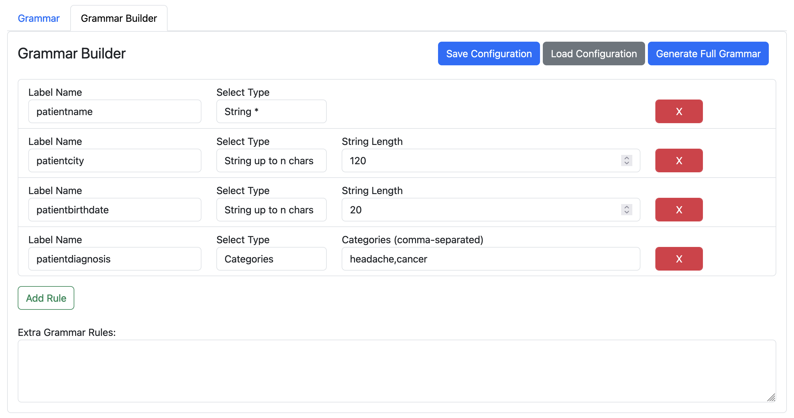

[](https://github.com/KatherLab/LLMAnonymizer/actions/workflows/docker-image.yml)

# LLM Anonymizer & Information Extraction Tool

> [!Important]
> This tool is in active development and is still undergoing major changes. 
> 
> **Use for research purposes only!**


Web-based tool to extract (personal) information from medical reports and redact and evaluate anonymization as well as extracted information.

**Features**:


- Supports various input formats: pdf, png, jpg, jpeg, txt and docx (only if Word is installed on your system)
- Performs OCR if necessary
- Extracts person-related information from the reports using a llama model
- Matches the extracted personal information in the reports using a fuzzy matching algorithm based on the Levenshtein distance (configurable)
- Compare documents and calculate metrics using annotated pdf files ([Inception](https://inception-project.github.io/))

**New**:

- Information Extraction using LLMs and Metric Calculation on Label-level


## Examples

Examples of doctoral reports in various formats can be found in the `examples` directory.


## Preparation

1. Download and extract or build [llama-cpp](https://github.com/ggerganov/llama.cpp) for your operating system.
2. Download desired models (must be compatible with llama-cpp, in gguf format)
3. Update the config.yml file with the downloaded models accordingly.
4. If you intend to use OCR: Install [OCRmyPDF](https://ocrmypdf.readthedocs.io/en/latest/installation.html#)
5. Create a python venv or a conda environment (tested with *Python 3.11.5*) with requirements.txt:
  - `python -m venv venv`
  - `source venv/bin/activate`
  - `pip install -r requirements.txt`

## Launch LLM Anonymizer

Run:
`python app.py`


|Parameter|Description|Example|
|---|---|---|
|--model_path|Directory with downloaded model files which can be processed by llama.cpp|/path/to/models|
|--server_path|Path of llama cpp executable (on Windows: server.exe).|/path/to/llamacpp/executable/server|
|--n_gpu_layers|How many layers of the model to offload to the GPU. Adjust according to model and GPU memory. Default: 80|-1 for all, otherwise any number|
|--host|Hostname of the server. Default: 0.0.0.0|0.0.0.0 or localhost|
|--port|Port on which this web app should be started on. Default: 5001|5001|
|--config_file|Custom path to the configuration file.|config.yml|
|--llamacpp_port|On which port to run the llama-cpp server. Default: 2929|2929|
|--debug|When set, the web app will be started in debug mode and with auto-reload, for debugging and development|
|--mode|Which mode to run ('choice will interactively ask the user'). Can be `anonymizer`, `informationextraction`, `choice`. Default: 'choice'|choice|

## Usage

### Preprocessing

- Click on **Preprocessing**

First, all input files are preprocessed to a csv file which contains all text from all reports. Currently pdf, docx, odf, txt, png and jpg files can be used as input. If necessary, text recognition (OCR) is applied. 

The output is a zip file containing the csv file and the pdf files with a text layer.

### LLM Information Extraction

> Extract personal information from the medical reports.

- Click on **LLM Information Extraction**

Use the zip file from the preprocessing step as an input, choose a model and adjust the prompt, grammar (use the grammar builder), n_predict and temperature accordingly. When you click `Run Pipeline` you will be redirected to the **LLM results** tab. Wait for the results to be available for download. You don't have to reload the page! In the meantime you can also start more information extraction jobs.

The output extends the input zip file with a csv file with columns `report` with the original report, `report_masked` which contains the anonymized report and more columns with the personal information extracted according to the grammar as well as Ids and metadata.

### Prepare Annotations

> To be able to evaluate the performance of the LLM Anonymizer tool, ground truth is needed.

1. Download [Inception](https://inception-project.github.io/)
2. Start a basic annotation project, upload the pdf files and annotate the parts of the reports you want to anonymize. Refer to the [Inception User Guide](https://inception-project.github.io/releases/32.2/docs/user-guide.html)
3. Export the annotated reports in the UIMA CAS JSON format (UIMA CAS JSON 0.4.0)
4. Make shure the filename of the exported json files matches the filename of the pdf files (except the extension like .json and .pdf)
5. Create a zip file of the exported json files (zip the json files directly, not a directory where they are located!)


### Report Redaction Metrics

> Calculate metrics for the anonymized reports by comparing to annotated reports (by [Inception](https://inception-project.github.io/))

- Click on **Report Redaction**

1. Use the output zip file from the LLM Information Extraction step as an input.
2. Also upload the prepared annotation zip file.
3. Enable and configure fuzzy matching if you want to use the fuzzy matching algorithm.
4. Choose between **Report Redaction Metrics** and **Report Redaction Viewer**
5. **Report Redaction Metrics** will run a job which calculates overall metrics for all the documents as well as a download link for the redacted documents.
6. **Report Redaction Viewer** will let you view the documents one-by-one with document-wise metrics and they are redacted on the fly.


## Additional Notes

> An active internet connection is currently required. This is because some javascript and CSS libraries are taken directly from CDNs. To change that please download them and replace the respective occurrences in the html files.


## Example Grammar

> [!Tip]
> **Use the new Grammar Builder**
> 
> 

> Adjust the grammar according to the [LLama-CPP GBNF Guide](https://github.com/ggerganov/llama.cpp/blob/master/grammars/README.md). This causes the llm output to be in a json structure with the desired datapoints. Note: Playing around with this can help, not every model works well with a too restrictive grammar.

```
root   ::= allrecords
value  ::= object | array | string | number | ("true" | "false" | "null") ws

allrecords ::= (
  "{"
  ws "\"patientennachname\":" ws string ","
  ws "\"patientenvorname\":" ws string ","
  ws "\"patientengeburtsdatum\":" ws string ","
  ws "\"patientenid\":" ws string ","
  ws "\"patientenstrasse\":" ws string ","
  ws "\"patientenhausnummer\":" ws string ","
  ws "\"patientenpostleitzahl\":" ws string ","
  ws "\"patientenstadt\":" ws string ","
  ws "}"
  ws
)

record ::= (
    "{"
    ws "\"excerpt\":" ws ( string | "null" ) ","
    ws "\"present\":" ws ("true" | "false") ws 
    ws "}"
    ws
)

object ::=
  "{" ws (
            string ":" ws value
    ("," ws string ":" ws value)*
  )? "}" ws

array  ::=
  "[" ws (
            value
    ("," ws value)*
  )? "]" ws

string ::=
  "\"" (
    [^"\\] |
    "\\" (["\\/bfnrt] | "u" [0-9a-fA-F] [0-9a-fA-F] [0-9a-fA-F] [0-9a-fA-F]) # escapes
  )* "\"" ws

number ::= ("-"? ([0-9] | [1-9] [0-9]*)) ("." [0-9]+)? ([eE] [-+]? [0-9]+)? ws

# Optional space: by convention, applied in this grammar after literal chars when allowed
ws ::= ([ \t\n])?
```


## TODO

- dockerize

- make excluded LLM output variable (what does the LLM answer if the information is unknown / not present in the text)
- When reports are split, put the already extracted information in the input for the next part.

- experimental: compare embeddings of llm output and annotation: calculate attention and then threshold

- csv in annotation subfolder

- preprocessing job progress: nicer list, tags, metadata

- When no annotation: reannotation column / whole new check&reannotate tab (check + string field or select / accoding to type selection - make type selection load grammar entries) - save as extra csv (so it can be used as annotation file)

- API

- OCR via trOCR (also models fine-tuned on handwriting available) or Nougat OCR
