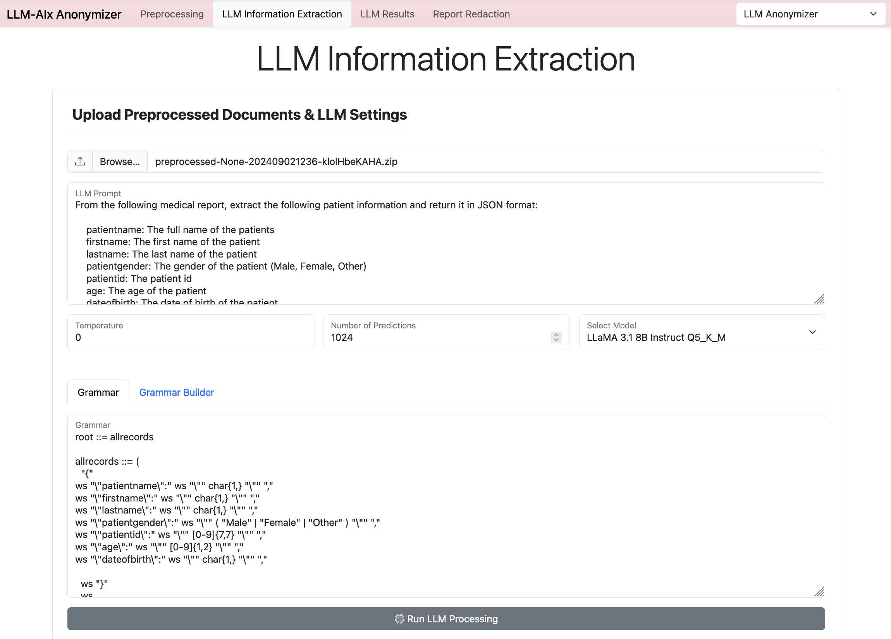
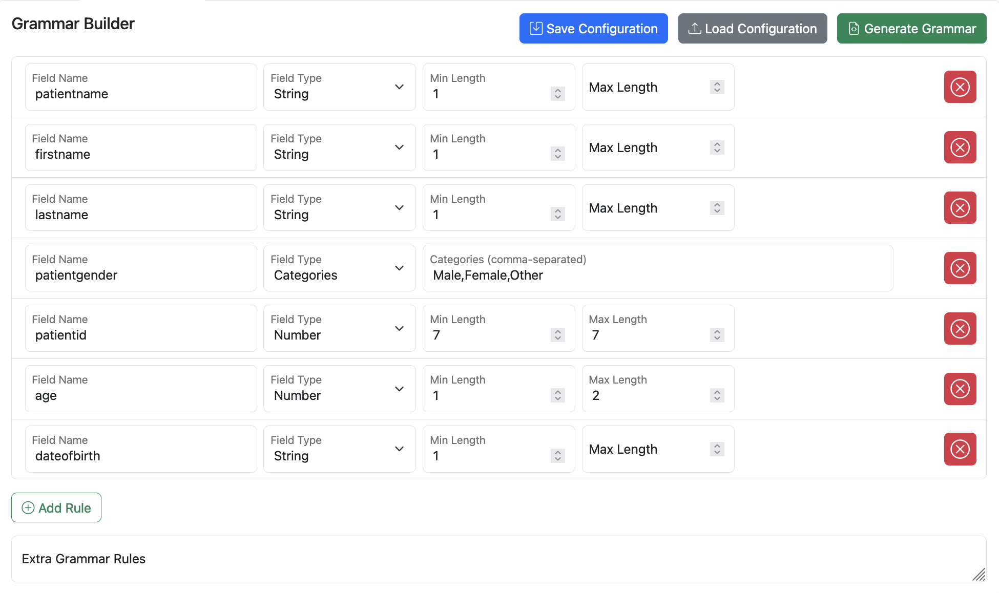
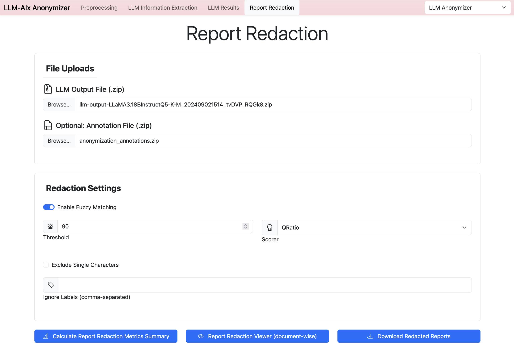
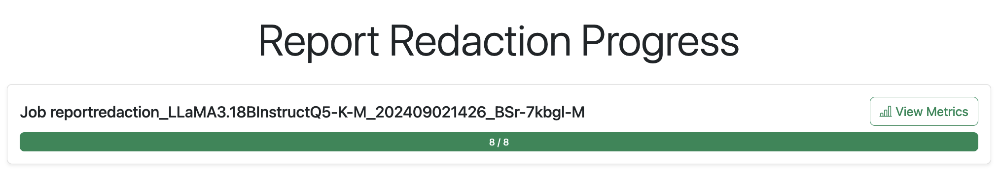
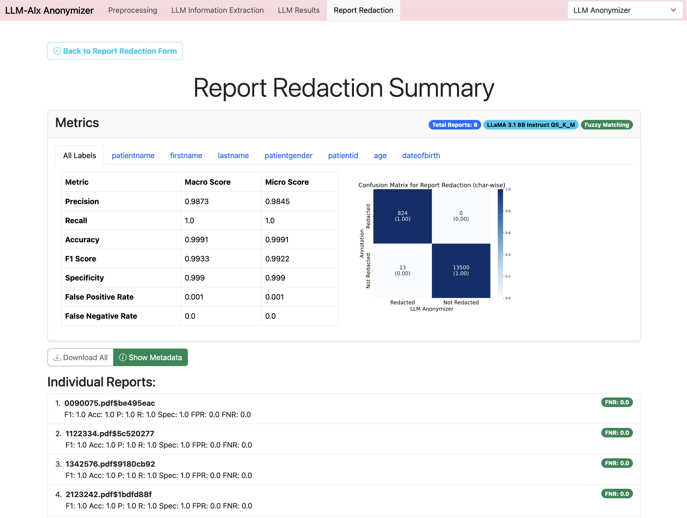
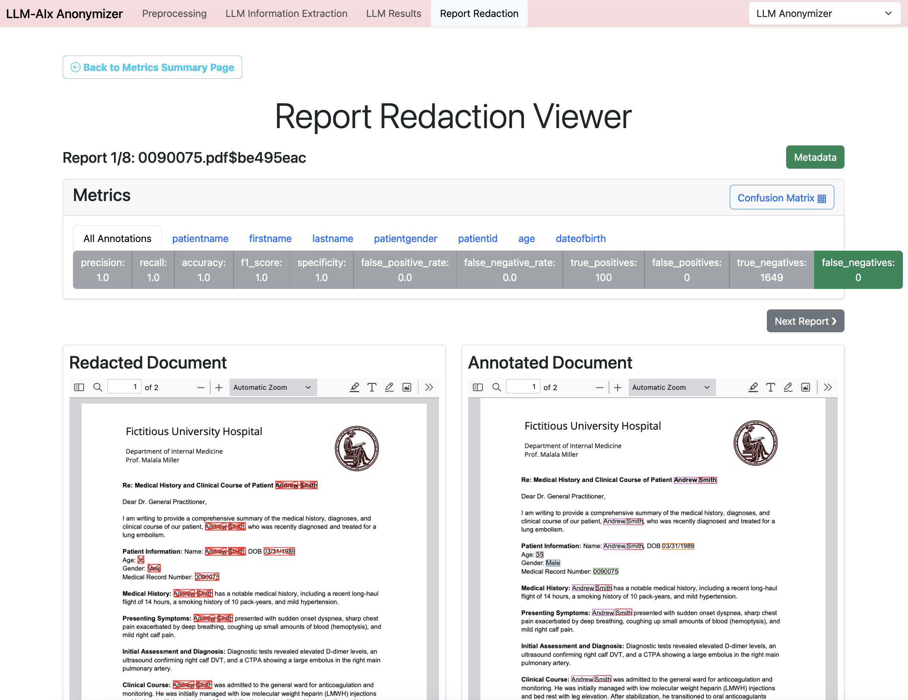

# Anonymization Tutorial

The goal for this tutorial is to help you get started with the anonymization pipeline. Our approach is to use the LLM to extract private information from medical reports. The LLM should generate a JSON object containing the extracted information so it can be transformed into a table and later be redacted from the original medical report.

> [!TIP]
> You can use the example reports and annotations and annotations in the `examples` directory. There you will find fictivous example reports (pdf documents), example grammar buidler configurations for information extraction and anonymization as well as ground truth annotations for both.

> [!IMPORTANT]
> Please switch the application to the **Anonymization** mode.

## Preprocessing

This tools supports a variety of input file formats. Preprocessing is necessary to ensure that the input is in the correct format.

The following file formats are supported:

- PDF (one report per file)
- DOCX (one report per file)
- ODF (one report per file)
- TXT (one report per file)
- PNG (one report per file)
- JPG (one report per file)
- CSV (needs an `id` and `report` column)
- XLSX (needs an `id` and `report` column)

If the input is an image or a PDF which contains no text, OCR (Optical Character Recognition) is automatically applied. You can choose between `tesseract` and `surya-ocr` for OCR.

> [!CAUTION]
> When you use preprocessing in the Anonymization mode, a **split length** field is shown. Here you can determine after how many characters the report should be splitted into parts. This was implemented as many earlier LLMs have a small context size and cannot process long reports. This mechanism lets the model extract the private information from each part of the report individually and redacts all extracted information from all parts in the whole document. Be careful, this might lead to false negatives as the model might hallucinate some information when it is not present in the current part.
>
> Try to use models with a sufficient context size instead!
>
> Never use a preprocessed zip file with split length for information extraction, as the evaluation will only consider the first part!


## LLM Information Extraction for Anonymization




The **prompt** should be build in a way that it is clear how the structure and keys of the JSON should be. Here you can also further explain the private information you want to extract and give examples.

The prompt needs to contain `{report}` which will be replaced by the medical report. The prompt should be written in a way that the model can just continue writing the prompt with the JSON.

Example prompt:
```
From the following medical report, extract the following patient information and return it in JSON format:

    patientname: The full name of the patients
    firstname: The first name of the patient
    lastname: The last name of the patient
    patientgender: The gender of the patient (Male, Female, Other)
    patientid: The patient id
    age: The age of the patient
    dateofbirth: The date of birth of the patient

This is the medical report:
{report}

The JSON:
```

---

The **grammar** ensures that the model can only generate valid JSON with only the correct keys. Internally it restricts what token the model is allowed to predict next.

Example grammar:

```
root ::= allrecords

allrecords ::= (
  "{"
ws "\"patientname\":" ws "\"" char{1,} "\"" ","
ws "\"firstname\":" ws "\"" char{1,} "\"" ","
ws "\"lastname\":" ws "\"" char{1,} "\"" ","
ws "\"patientgender\":" ws "\"" ( "Male" | "Female" | "Other" ) "\"" ","
ws "\"patientid\":" ws "\"" [0-9]{7,7} "\"" ","
ws "\"age\":" ws "\"" [0-9]{1,2} "\"" ","
ws "\"dateofbirth\":" ws "\"" char{1,} "\"" ","

  ws "}"
  ws
)

ws ::= ([ \t\n])?

char ::= [^"\\] | "\\" (["\\/bfnrt] | "u" [0-9a-fA-F] [0-9a-fA-F] [0-9a-fA-F] [0-9a-fA-F])
```

To make writing a grammar easy, you can use the **Grammar Builder**, which allows you to graphically build the JSON structure including restrictions (like String or Number length, boolean values, categories).



You can save and load the Grammar Builder configuration. Press **Generate Grammar** to generate the grammar.

---

The **temperature** parameter determines the randomness of the model. A higher temperature makes the model more unpredictable / creative. A temperature of 0.0 makes the model deterministic.

---

The **n_predict** parameter determines how many tokens the model is allowed to generate. One token can be a part of a word, a special character, or even a whole word. You have to estimate how many tokens the desired output JSON might use. 
In theory you can set this parameter to a very large number, but keep in mind that both your prompt including the report AND the generated JSON must fit into the model context size defined in the kv_cache_size which is set in the model config file. 
A realisitic parameter is important to warn you if some reports are too long for the model.

In general a model is trained to work with a certain context size (e.g. in case of Llama 3.1 it is 128k tokens). In the model config you can set the kv_cache_size to the model context size or smaller (keep in mind, that the kv cache can also use large portions of your GPU memory, depending on the model size).


---
### Run / Download Information Extraction for Anonymization

When you press the button, the model will be loaded to your GPU which might take some time. Afterwards the results will be available for download. The download contains a zip archive with the original documents and a llm output csv file with the extracted patient information in separate columns. A column called `report_masked` is appened with the redacted text.

---

## Evaluation: Report Redaction

Go to the **Report Redaction** page. Select the llm output zip file.



### Download Redacted Documents

In addition to the redacted text in the llm output csv (column `report_masked`) inside of the output zip, you can also download the redacted pdf documents. Documents which were not provided in a pdf format are automatically converted into a pdf document.

Click on **Download Redacted Reports**.

### Prepare Annotations

> To be able to evaluate the performance of the Anonymization tool, a ground truth is needed.

1. Download [Inception](https://inception-project.github.io/)
2. Start a basic annotation project, upload the pdf files and annotate the parts of the reports you want to anonymize. Refer to the [Inception User Guide](https://inception-project.github.io/releases/32.2/docs/user-guide.html)
3. Export the annotated reports in the UIMA CAS JSON format (UIMA CAS JSON 0.4.0) - Note: Use the export button in the **Annotation** mode, not in the curation mode!
4. Make shure the filename of the exported json files matches the filename of the pdf files (except the extension like .json and .pdf)
5. Create a zip file of the exported json files (zip the json files directly, not a directory!)


### Evaluate Anonymization

In the **Report Redaction** page, select an annotation zip file in addition to the llm output zip file. In the __Redaction Settings__ section you can further specify the entity matching of the anonymization. Here you can select fuzzy matching to also find occurences of personal information in the reports where either the LLM output is slightly wrong or typos are in the reports.

Click on **Report Redaction Metrics**.



Scroll down, a job in the **Report Redaction Progress** section will be shown and press **View Metrics** as soon as the job is finished. In some cases it might happen that the progress bar cannot update correctly or immediately turns red. In this case, try to reload the page. If this does not work, look into the console for errors and/or start the application with the `--debug` flag.




Now you can see the **Report Redaction Summary** page. Here you can see metrics for the individual categories as well as overall scores. You can also download the metrics as a csv file. You can display individual reports by clicking on the respective list items. The green or red pill indicates if there were any false negatives (things that should have been anonymized but are not) in the individual report. 



When you view the individual reports, you can see the scores for each report. In addition the redacted pdf as well as the annotated pdf are shown side-by-side.


