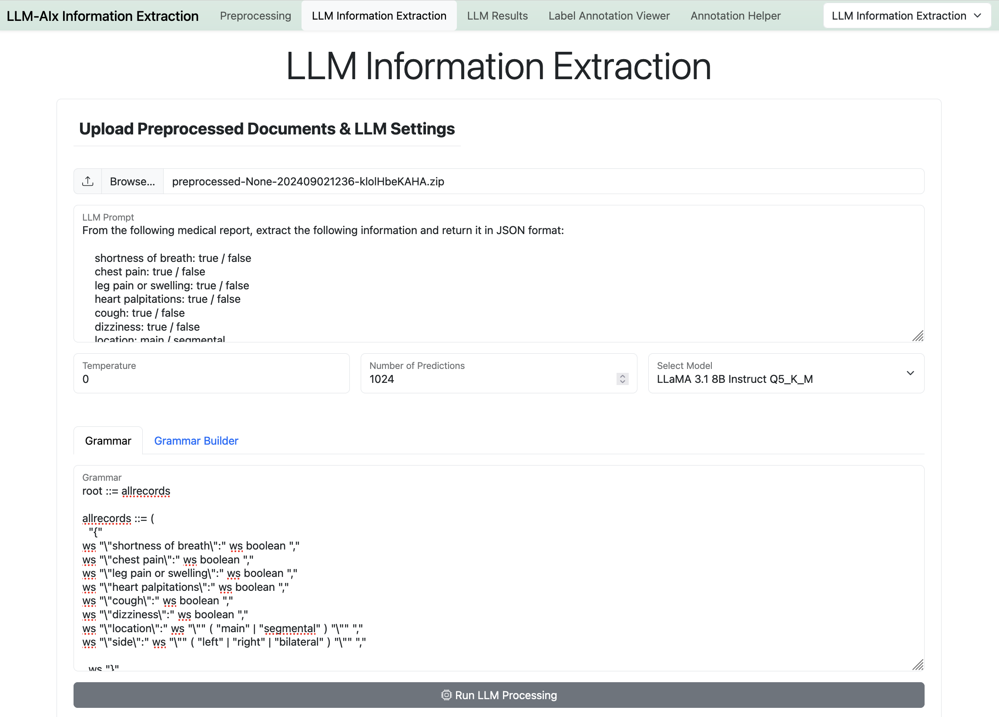
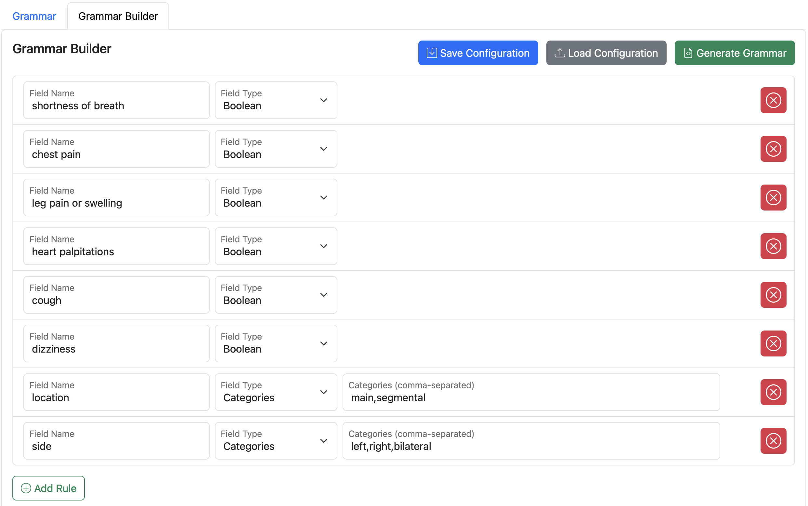
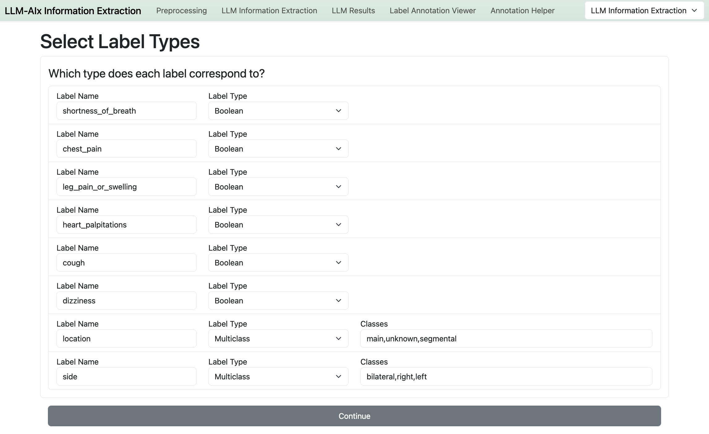
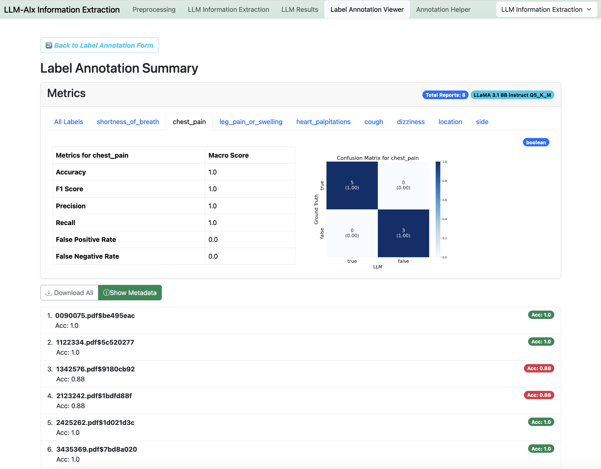

# Information Extraction Tutorial

The goal for this tutorial is to help you get started with the information extraction example. Our approach is to use the LLM to extract information from medical reports. The LLM should generate a JSON object containing the extracted information so it can be transformed into a table format.

> [!TIP]
> You can use the example reports and annotations and annotations in the `examples` directory. There you will find fictivous example reports (pdf documents), example grammar buidler configurations for information extraction and anonymization as well as ground truth annotations for both.

> [!IMPORTANT]
> Please switch the application to the **Information Extraction** mode.

## Preprocessing

This tools supports a variety of input file formats. Preprocessing is necessary to ensure that the input is in the correct format.

The following file formats are supported:

- PDF (one report per file)
- DOCX (one report per file)
- ODF (one report per file)
- TXT (one report per file)
- PNG (one report per file)
- JPG (one report per file)
- CSV (needs an `id` and `report` column)
- XLSX (needs an `id` and `report` column)

If the input is an image or a PDF which contains no text, OCR (Optical Character Recognition) is automatically applied. You can choose between `tesseract` and `surya-ocr` for OCR.


## LLM Information Extraction




The **prompt** should be build in a way that it makes clear how the structure of the JSON should be. Here you can also further explain the information you want to extract and give examples.

The prompt needs to contain `{report}` which will be replaced by the medical report. The prompt should be written in a way that the model can just continue writing the prompt with the JSON.

Example prompt:
```
From the following medical report, extract the following information and return it in JSON format:

    shortness of breath: true / false 
    chest pain: true / false
    leg pain or swelling: true / false
    heart palpitations: true / false
    cough: true / false
    dizziness: true / false
    location: main / segmental / unknown
    side: left / right / bilateral

This is the medical report:
{report}

The JSON:
```

> [!TIP]
> It might be helpful to incorporate the prompt / instruction template into the prompt for instruction-tuned models. 
>
> The prompt will be used in the `/completion` endpoint without applying a prompt- or chat template!

---

The **grammar** ensures that the model can only generate valid JSON with only the correct keys. Internally it restricts what token the model is allowed to predict next.

Example grammar:

```
root ::= allrecords

allrecords ::= (
  "{"
ws "\"shortness of breath\":" ws boolean ","
ws "\"chest pain\":" ws boolean ","
ws "\"leg pain or swelling\":" ws boolean ","
ws "\"heart palpitations\":" ws boolean ","
ws "\"cough\":" ws boolean ","
ws "\"dizziness\":" ws boolean ","
ws "\"location\":" ws "\"" ( "main" | "segmental" | "unknown" ) "\"" ","
ws "\"side\":" ws "\"" ( "left" | "right" | "bilateral" ) "\"" ","

  ws "}"
  ws
)

ws ::= ([ \t\n])?

boolean ::= "\"" ("true" | "false") "\"" ws
```

To make writing a grammar easy, you can use the **Grammar Builder**, which allows you to graphically build the JSON structure including restrictions (like String or Number length, boolean values, categories).



You can save and load the Grammar Builder configuration. Press **Generate Grammar** to generate the grammar.

> [!NOTE]
> You can also manually write your own grammar. See [LLama-CPP GBNF Guide](https://github.com/ggerganov/llama.cpp/blob/master/grammars/README.md).

---

The **JSON Schema** can be used alternatively to the grammar. If you switch on the **Use JSON Schema** checkbox, the grammar will be ignored and the JSON Schema will be used instead. There is a JSON Schema Builder which works like the Grammar Builder.

> [!NOTE]
> In the future, mostly JSON schemas should be used to be able to use structured output also with other OpenAI-compatible APIs.

Example JSON Schema: 

```
{
  "type": "object",
  "properties": {
    "shortness of breath": {
      "type": "boolean"
    },
    "chest pain": {
      "type": "boolean"
    },
    "leg pain or swelling": {
      "type": "boolean"
    },
    "heart palpitations": {
      "type": "boolean"
    },
    "cough": {
      "type": "boolean"
    },
    "dizziness": {
      "type": "boolean"
    },
    "location": {
      "type": "string",
      "enum": ["main", "segmental", "unknown"]
    },
    "side": {
      "type": "string",
      "enum": ["left", "right", "bilateral"]
    }
  },
  "required": ["shortness of breath", "chest pain", "leg pain or swelling", "heart palpitations", "cough", "dizziness", "location", "side"]
}
```

You can also find the Schema to import in the JSON Schema Builder in `examples/schemas/ie_schema.csv`.

---

The **temperature** parameter determines the randomness of the model. A higher temperature makes the model more unpredictable / creative. A temperature of 0.0 makes the model deterministic.

---

The **n_predict** parameter determines how many tokens the model is allowed to generate. One token can be a part of a word, a special character, or even a whole word. You have to estimate how many tokens the desired output JSON might use. 
In theory you can set this parameter to a very large number, but keep in mind that both your prompt including the report AND the generated JSON must fit into the model context size defined in the kv_cache_size which is set in the model config file. 
A realisitic parameter is important to warn you if some reports are too long for the model.

In general a model is trained to work with a certain context size (e.g. in case of Llama 3.1 it is 128k tokens). In the model config you can set the kv_cache_size to the model context size or smaller (keep in mind, that the kv cache can also use large portions of your GPU memory, depending on the model size).


---
### Run / Download Information Extraction

When you press the button, the model will be loaded to your GPU which might take some time. Afterwards the results will be available for download. The download contains a zip archive with the original documents and a llm output csv file with the extracted information in separate columns.

---

## Evaluation: Label Annotation Viewer

If you have a ground truth for the extracted information you can evaluate the performance of the Large Language Model for the task.

For this you can upload the downloaded zip file from the LLM output step. You also need a csv or excel file with the ground truth including one id column and one column for each extracted label. The id is either the filename of your original documents or the id column in your csv or excel file. The column names should be the same as the extracted labels according to the grammar!

In the next step you will be asked which type of classification problem each label belongs to. You can choose between **boolean**, **multiclass** or **stringmatch**. For Boolean both your LLM output and the annotations should contains values like `0/1` or `true/false` (case-insensitive). For multiclass the same classes which are in the annotation must also be in the LLM output. For stringmatch the LLM output and the annotations will be compared individually sample-per-sample. The comparison is case-insensitive.




Afterwards you will see a summary page with the aggregated results for each label. You can also see a list of all reports including their individual overall accuracy score. The **Download All** button enables you to download a csv file with all results (inside of a zip file).



You can also view the metrics for each report to see what the LLM was able or was not able to predict.


## LLM-based Annotation Creation

The **Annotation Helper** tool enables you to create your own annotation based on what the LLM predicted. You can view the LLM output with the document side-by-side and adjust the annotations if necessary. 


> [!TIP]
> If you want to know how well the LLM is able to predict your annotations, you can use the **Label Annotation Viewer** with your manually curated annotations csv file as the ground truth. 


## Use additional Reasoning

You can add a reasoning column to your grammar (add it as first row as it will be generated before the other JSON fields).


The prompt then could look like this:
```
From the following medical report, extract the following information and return it in JSON format. First, please provide a reasoning for each non-trivial information to be extracted. Please still keep the reasoning short and to the point.

    reasoning: Please reason in this field about the following json fields if the information in the report is not trivial for extracting it.
    shortness of breath: true / false 
    chest pain: true / false
    leg pain or swelling: true / false
    heart palpitations: true / false
    cough: true / false
    dizziness: true / false
    location: main / segmental / unknown
    side: left / right / bilateral

This is the medical report:
{report}

The JSON:
```

An example grammar with a reasoning column:

```
root ::= allrecords

allrecords ::= (
  "{"
ws "\"reasoning\":" ws "\"" char{1,2000} "\"" ","
ws "\"shortness of breath\":" ws boolean ","
ws "\"chest pain\":" ws boolean ","
ws "\"leg pain or swelling\":" ws boolean ","
ws "\"heart palpitations\":" ws boolean ","
ws "\"cough\":" ws boolean ","
ws "\"dizziness\":" ws boolean ","
ws "\"location\":" ws "\"" ( "main" | "segmental" | "unknown" ) "\"" ","
ws "\"side\":" ws "\"" ( "left" | "right" | "bilateral" ) "\"" ","

  ws "}"
  ws
)

ws ::= ([ \t\n])?

char ::= [^"\\] | "\\" ([\\bfnrt/] | "u" [0-9a-fA-F] [0-9a-fA-F] [0-9a-fA-F] [0-9a-fA-F])
boolean ::= "\"" ("true" | "false") "\"" ws
```

Note: This grammar limits the reasoning to 2000 characters. Please adjust this limit according to your needs!
Note: Please use this adjusted char rule as it excludes " characters leading to the llm being able to destroy the json structure within the reasoning field.